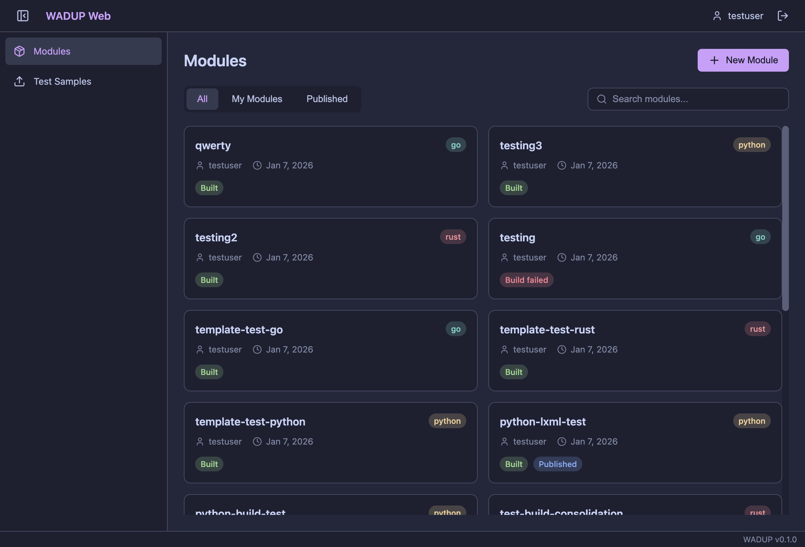
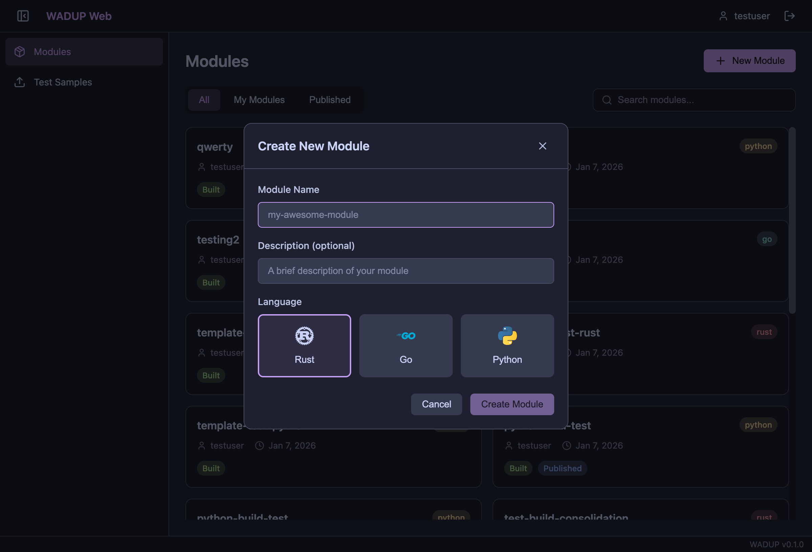
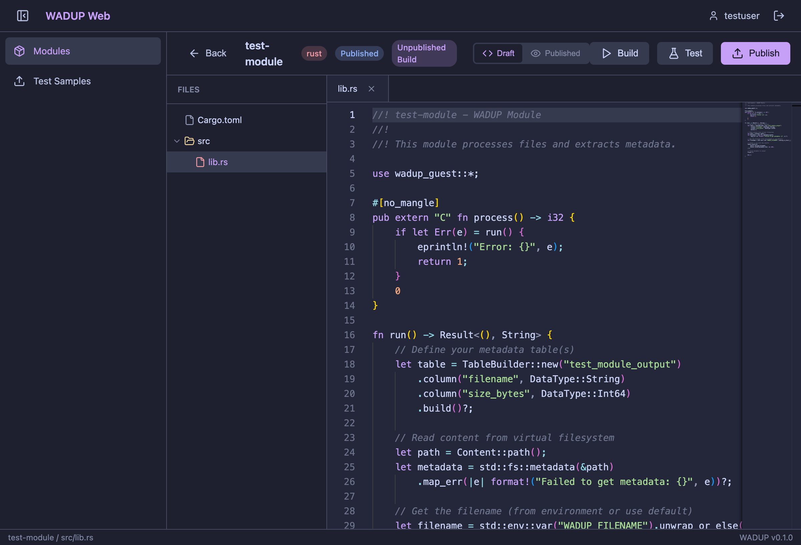
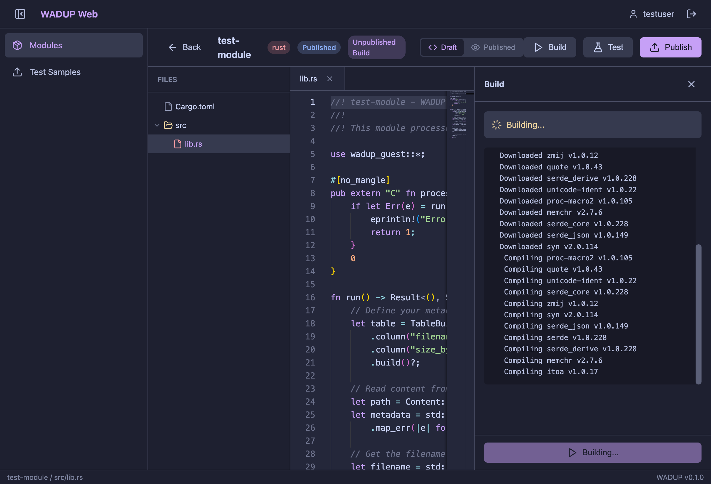
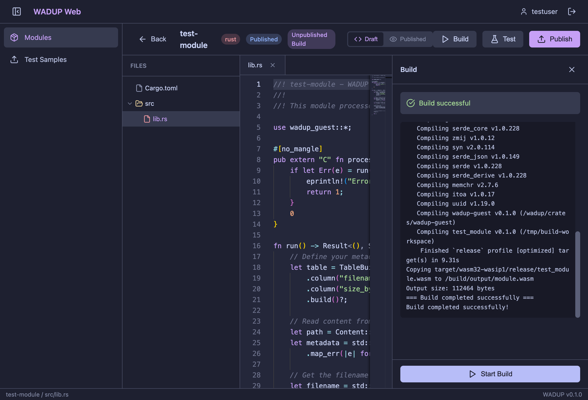
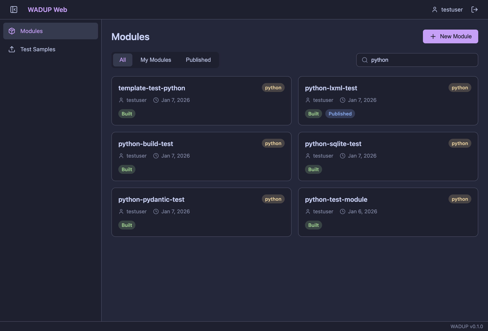
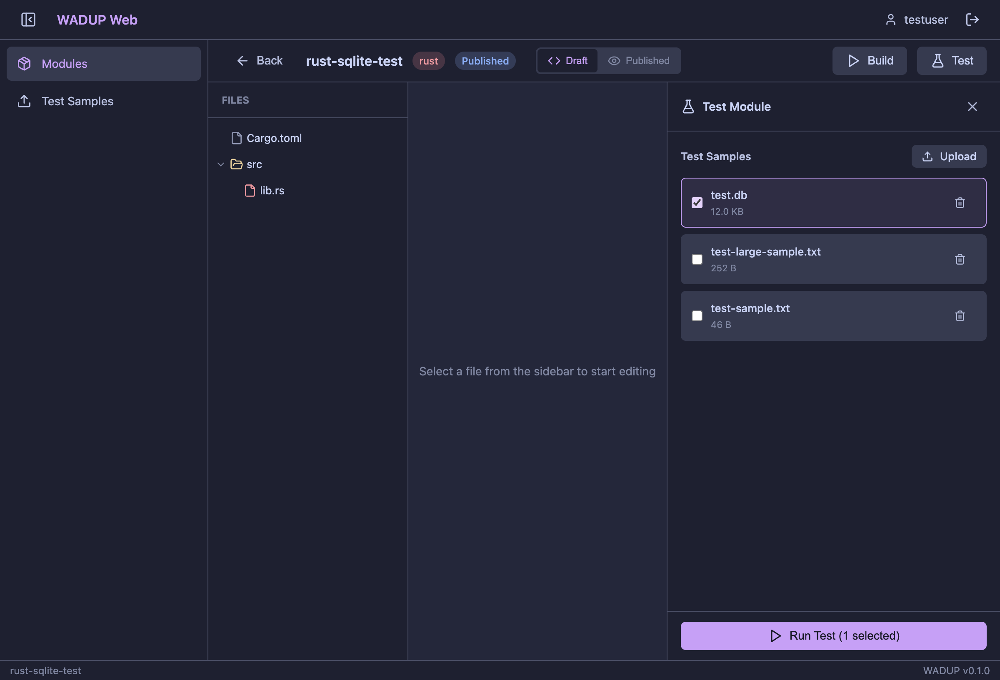
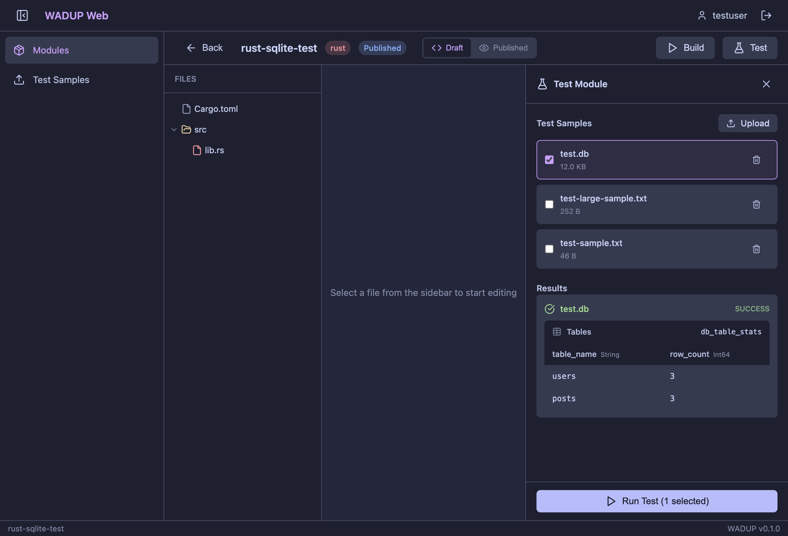

# WADUP Web Screenshots

This document describes the features shown in each screenshot of the WADUP Web application.

## 1. Modules List

The main modules view displays all WADUP modules in a card-based layout. Each card shows:
- Module name and programming language (Rust, Go, or Python)
- Author and last modified date
- Build status (Built, Build failed, or no status)
- Published status badge for modules shared with other users
- Quick delete button

The toolbar provides filtering options (All, My Modules, Published) and a search box.

## 2. Create Module Dialog

The "New Module" dialog allows users to create a new WADUP module. Features include:
- Module name input field
- Optional description field
- Language selection with visual icons for Rust, Go, and Python
- Each language option shows its logo for easy identification

## 3. Code Editor

The Monaco-based code editor provides a VS Code-like editing experience:
- File tree sidebar showing the module's directory structure
- Tabbed interface for editing multiple files
- Syntax highlighting with the Catppuccin Macchiato theme
- Line numbers and code folding
- Action buttons for Build, Test, and Publish in the header
- Draft/Published version toggle for viewing different module versions

## 4. Build In Progress

The build panel shows real-time compilation progress:
- Animated spinner indicating build is running
- Live-streaming build logs from the Docker container
- Shows cargo/compiler output including dependency downloads and compilation steps
- "Building..." button is disabled during compilation

## 5. Build Completed

After a successful build:
- Green checkmark icon indicates success
- Complete build log showing all compilation steps
- Final output size displayed (e.g., "Output size: 112464 bytes")
- "Build completed successfully" message
- "Start Build" button is re-enabled for rebuilding

## 6. Module Search

The search functionality filters modules in real-time:
- Type in the search box to filter by module name
- Results update instantly as you type
- In this example, searching "python" shows only Python modules
- All module information (language, author, status) remains visible in filtered results

## 7. Test Panel

The test panel allows testing modules against sample files:
- List of available test samples with file sizes
- Checkbox selection for choosing which samples to test
- Upload button to add new test samples
- Delete button (trash icon) to remove samples
- "Run Test" button shows the count of selected samples
- In this example, testing a Rust SQLite module with a `test.db` sample file

## 8. Test Results

After running tests, results are displayed in a structured format:
- Success/failure status for each tested sample
- Tables dropdown showing all output tables generated by the module
- Data table with column headers showing field names and types
- Actual data rows with extracted metadata (here showing SQLite table statistics: `users` with 3 rows, `posts` with 3 rows)
